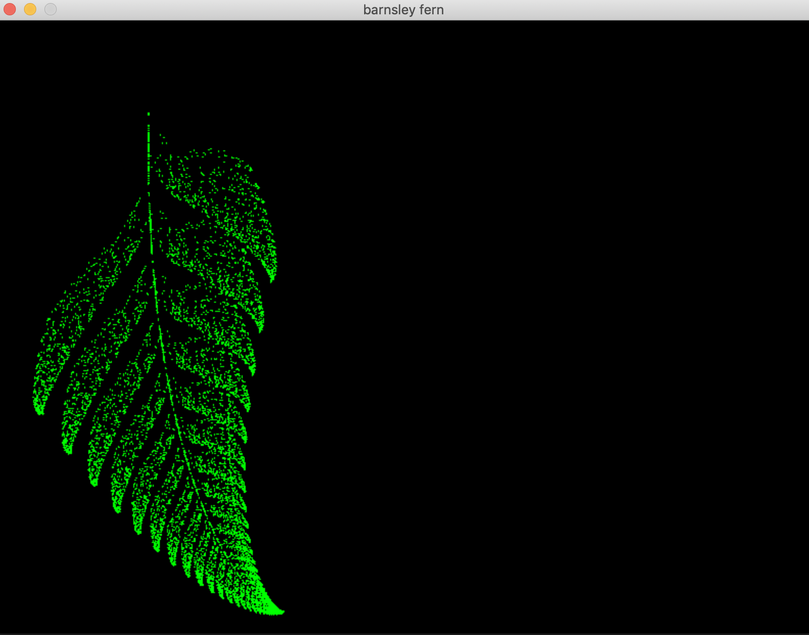

# barnsley_fern
Barnsley Fern fractal in Funk!

<p style="text-align:center;"></p>

## To build:

Make sure you get the Funk toolchain from [here](https://github.com/diegovalverde/funk | width=100).

```python <path_to_your_funk>/funky.py game_of_life.f --include <path_to_your_funk>/include```

Also, you may need to install [simple 2d library](https://github.com/simple2d/simple2d)


To compile the example:
```
python ../funk/funky.py barnsley_fern.f --include ../funk/include
```
